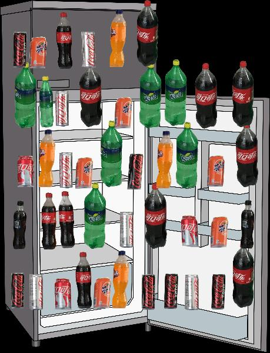

## augment data

### Method 1: paste patches

Through paste item patches on background to augment detection data

```
python paste_patches.py --front_dir front_dir \
    --background_dir background_dir \
    --output_dir output_dir \
    --count 100
```

some examples:


